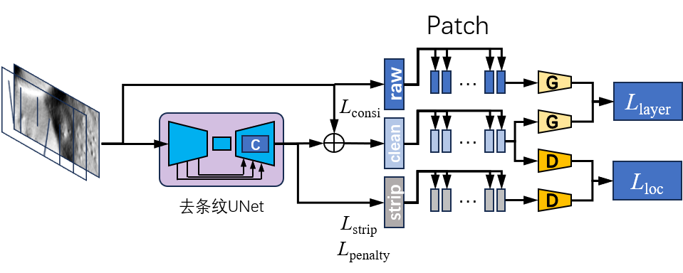

# Model
Diffusion-based Object Detection Network
用中文记录下来


# Workflow

# Installation
First, you should clone this repostry to your local machine.
```bash
git clone git@github.com:BugBubbles/DDN.git
```
## conda
Then, you should install the dependencies. For the most convenient way , you can use your conda tools.
```bash
conda envs create -f environment.yaml
```
And activate your conda virtual environment.
```bash
conda activate destrip
```
## pip
(Deprecated) *Or you can use pip tools:*
```bash
pip install -r requirements.txt
```

# Data Preparation
This project use Mircosoft COCO datasets for training and validation. You should download the datasets from the official website.
```bash
mkdir -p data/coco
cd data/coco
wget http://images.cocodataset.org/zips/train2017.zip
wget http://images.cocodataset.org/zips/val2017.zip
wget http://images.cocodataset.org/zips/test2017.zip
wget http://images.cocodataset.org/annotations/annotations_trainval2017.zip
unzip train2017.zip 
unzip val2017.zip
unzip test2017.zip
unzip annotations_trainval2017.zip
```

## Eval
```bash
. ./scripts/eval.sh
```

## Train
```bash
. ./scripts/train.sh
```

# Acknowledge
ldm, LPIPS, SSIM

DiffusionDet: Diffusion Model for Object Detection